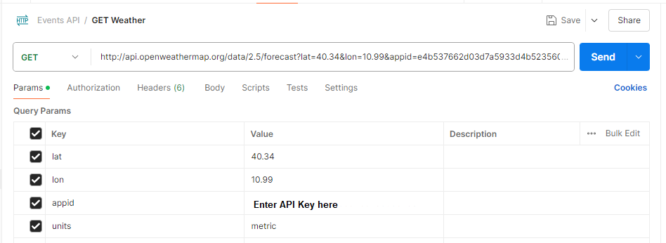
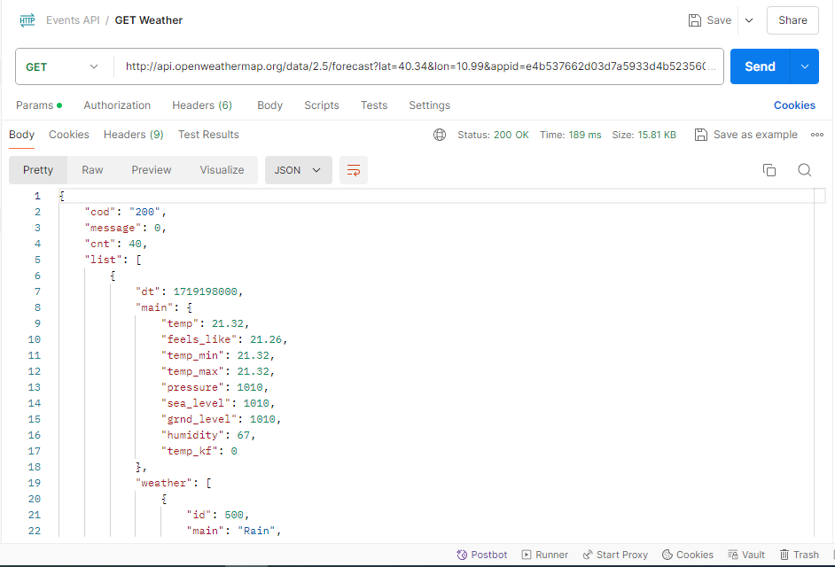

# API Details

## 1. Fetch List of Cities (GET Cities)

- **URL:** `https://weather-forecast-g9kz.onrender.com/cities`
- **Method:**   GET
- **Details:**
  - Retrieves the list of small cities from the database (MongoDB).
  - Responds with 200(Ok) with cities information as JSON
  - Sample response JSON can be found [here](frontend/Data/citiesData/cities.js).

  - **Sample Input Output:**

    

## 2. Fetch Weather Details (GET Weather)

- **URL:** `https://api.openweathermap.org/data/2.5/forecast?lat={latitude}&lon={longitude}&appid={API key}&units=metric`
- **Method:**   GET
- **Details:**
  - Retrieves weather details based on the latitude and longitude and app key from the weathers API.
  - Responds with 200(Ok) with weather information as JSON
  - Sample response JSON can be found [here](/frontend/Data/WeatherData.js).

  - **Sample Input:**

    

  - **Sample Output:**

    
